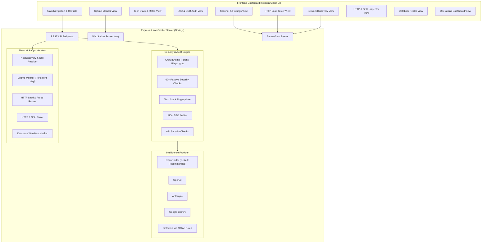

<div align="center">

# 🦋 Monarch Security Engine

### Automated Web Vulnerability Scanner, Attack Surface Mapper & Network Operations Hub

**Crawl a target → record every request DevTools-style → detect tech stack & API rate limits → audit technical SEO & AIO → discover local network devices & hardware vendors → run concurrent load & security tests → test SSH & databases → get OpenRouter/AI remediation plans → export Markdown, HTML, and JSON.**

[](https://github.com/mahmud-r-farhan/Monarch-Security-Engine/actions/workflows/ci.yml)


</div>

---

> ⚠️ **Disclaimer** — Monarch is strictly for **educational use, defensive research, and auditing systems you own or are explicitly authorised to test**. Scanning third-party targets without permission is illegal. The scanner is passive by design, but you remain responsible for where you point it.

---

## ✨ Features & Capabilities

Monarch provides a comprehensive cyber operations and security auditing dashboard:

- 🤖 **OpenRouter AI (Default Provider)**: Multi-model AI auditing supporting DeepSeek, Claude, GPT, and Llama. Runs completely offline without `.env`, or configure keys dynamically directly in the web UI.
- ⚡ **Site Technology Fingerprinting**: Identifies React, Next.js, Vue, Angular, WordPress, Express, PHP, Django, Rails, Spring Boot, Apache, Nginx, Cloudflare, and CDNs.
- 🚦 **API Rate Limiting & Throttling Analysis**: Inspects RFC & `X-RateLimit-*` headers across endpoints, detects brute force vulnerability and absence of burst protection.
- 🔍 **Technical SEO & AIO (AI Crawlability) Audit**: Evaluates `<title>`, meta descriptions, canonical URLs, semantic `<h1>` hierarchy, OpenGraph, Twitter cards, and structured JSON-LD schemas.
- 📡 **Local Network Discovery & Port Scanner**: Parses ARP cache, resolves hardware manufacturers via IEEE MAC OUI prefixes (Apple, Cisco, Intel, Raspberry Pi, Espressif, Ubiquiti, etc.), and conducts fast concurrent TCP port mapping.
- ⏱️ **Uptime & Latency Monitoring**: Continuous synthetic health checks with response time sparklines, keyword verification, status history, and real-time WebSocket push.
- 🚀 **High-Performance HTTP Load Tester**: Concurrency pool, live Requests-Per-Second (RPS) meter, and p50/p90/p95/p99 latency percentiles with built-in automated security probes (CSRF, SQLi, XSS, rate-limit bursts).
- 🔌 **HTTP Inspector & SSH Banner Poker**: Craft custom requests with Bearer/Basic/API-Key auth, or probe SSH ports (22) for software version banners and OS hints.
- 🗄️ **Database Connection Tester**: Test wire protocol handshakes and benchmark concurrent connection latency for PostgreSQL, MySQL, MongoDB, Redis, and MSSQL.
- 📊 **Security Operations Dashboard**: Severity breakdowns, doughnut distributions, category rankings, and posture analytics.

---

## 🏛️ Architecture Overview



---

## 🚀 Quick Start

### 1. Clone & Install
```bash
git clone https://github.com/mahmud-r-farhan/Monarch-Security-Engine.git
cd Monarch-Security-Engine
npm install
```

### 2. Configure Environment (Optional)
Monarch works **100% out of the box without any `.env` file** using its built-in rules engine and in-UI settings. If you prefer environment variables:
```bash
cp .env.example .env
```

### 3. Launch Monarch
```bash
npm start
# 🦋 Monarch Security Engine → http://localhost:3000
```

### 4. Practice with Demo Target
In a separate terminal, launch the intentionally vulnerable practice application:
```bash
npm run demo:target
# Demo target running at http://localhost:4000
```
Then point Monarch at `http://localhost:4000` to see vulnerability findings, AI insights, technology stack detection, and network traffic!

---

## 🛡️ Core Features & Tabs

### 1. Scanner & Active Audit
- **60+ Passive Checks**: Headers (CSP, HSTS, XFO, COOP, Permissions-Policy), Cookies (HttpOnly, Secure, SameSite), JWTs (`alg=none`, secrets, expiration, Web Storage), CORS (wildcard origin, credentials), DOM-XSS sinks, and sensitive file probes (`.env`, `.git`, backups, source maps).
- **Live DevTools Network Log**: Inspect method, status, size, timing, waterfall, request headers, and response payloads.
- **AI Remediation Plan**: Executive summary, attack narrative chain, root cause analysis, and prioritized action plan with copy-pasteable configuration snippets.
- **Export Options**: Download comprehensive reports in Markdown (`.md`), standalone self-contained HTML (printable to PDF), or raw JSON.

### 2. Site Technology & API Rate Limits
- **Framework & CMS Detection**: Discovers frontend and backend technology stacks from HTTP headers, cookies, and HTML DOM patterns.
- **Rate Limit Auditing**: Evaluates RFC RateLimit headers, burst resilience, and identifies unthrottled API endpoints.

### 3. AIO & Technical SEO Audit
- **Metadata Validation**: Analyzes `<title>` and `<meta name="description">` length and keyword suitability.
- **Semantic Structure**: Inspects `<h1>`, `<h2>`, and `<h3>` document hierarchy.
- **Social & AI Crawling**: Audits OpenGraph (`og:*`), Twitter Cards, structured JSON-LD schemas, language tags, and responsive viewports.

### 4. Local Network Discovery
- **ARP Device Table**: Reads local ARP cache across Windows, Linux, and macOS.
- **Hardware Vendor Resolution**: Matches MAC address prefixes against an extensive IEEE OUI database (Apple, Raspberry Pi, Cisco, Intel, Espressif, Samsung, etc.).
- **TCP Port Scanning**: High-speed asynchronous port scanning with service banner identification.

### 5. Uptime & Latency Monitoring
- **Periodic Health Probes**: Configurable polling intervals (15s, 30s, 1m, 5m).
- **Latency Sparklines**: Visual response time progression and uptime percentage.
- **Real-Time WebSocket Push**: Instantly broadcasts status transitions to connected dashboards.

### 6. High-Performance HTTP Load Tester
- **Concurrent Workers**: Configurable concurrency (1–100) and request volume (up to 2,000).
- **Percentiles**: Computes min, max, avg, p50, p90, p95, and p99 latency metrics.
- **Automated Security Probing**: Tests for CSRF origin rejection, SQL injection parameter error disclosure, reflected XSS encoding, and rate-limit bursts.

### 7. HTTP & SSH Service Poker
- **HTTP Inspector**: Craft granular requests with custom methods, query parameters, auth headers (Bearer, Basic, API Key), and inspect headers/body.
- **SSH Banner Grabber**: Connects to SSH port 22, measures handshake latency, and parses daemon banners and OS hints.

### 8. Database Connection Tester
- **Wire Protocol Handshakes**: Probes PostgreSQL (5432), MySQL (3306), MongoDB (27017), Redis (6379), and MSSQL (1433).
- **Concurrent Stress Test**: Fires 30 concurrent connection probes to benchmark database latency under load.

---

## 📡 REST API & WebSocket Reference

| Method | Endpoint | Description |
|---|---|---|
| `GET` | `/api/health` | Service status, active AI provider, version, and active monitors |
| `GET` | `/api/config` | Returns active AI configuration and supported providers |
| `POST` | `/api/config` | Sets runtime AI provider, API key, and model in memory |
| `POST` | `/api/scans` | Initiates asynchronous web vulnerability scan |
| `GET` | `/api/scans/:id` | Returns full scan report JSON |
| `GET` | `/api/scans/:id/events` | Server-Sent Events stream of real-time scan progress |
| `GET` | `/api/scans/:id/report.:fmt` | Exports report as `md`, `html`, or `json` |
| `GET` | `/api/monitors` | Lists all configured uptime monitors with health metrics |
| `POST` | `/api/monitors` | Creates a new uptime monitor job |
| `POST` | `/api/monitors/:id/check` | Triggers immediate check of a monitor |
| `DELETE` | `/api/monitors/:id` | Deletes an uptime monitor |
| `POST` | `/api/loadtest/run` | Executes HTTP load test with SSE metric streaming |
| `GET` | `/api/netdiscovery/interfaces` | Returns local network interfaces and IP addresses |
| `GET` | `/api/netdiscovery/arp` | Returns discovered ARP table hosts and hardware vendors |
| `POST` | `/api/netdiscovery/scan` | Runs full LAN discovery scan with SSE streaming |
| `POST` | `/api/netdiscovery/scan-host` | Scans TCP ports on a specific host |
| `POST` | `/api/poke` | Sends custom HTTP request and returns complete response metadata |
| `POST` | `/api/poke/ssh` | Checks SSH port reachability and grabs software banner |
| `POST` | `/api/db/test` | Executes database wire protocol handshake |
| `POST` | `/api/db/stress` | Runs concurrent database connection stress test |
| `WS` | `/ws` | Real-time WebSocket connection for live monitor updates |

---

## ⚙️ Configuration

| Variable | Default | Description |
|---|---|---|
| `PORT` | `3000` | Port for web dashboard and REST API |
| `AI_PROVIDER` | `openrouter` | Default AI provider: `openrouter`, `openai`, `anthropic`, `gemini`, or `none` |
| `OPENROUTER_API_KEY` | — | OpenRouter API Key |
| `OPENROUTER_MODEL` | `deepseek/deepseek-r1-distill-qwen-7b` | OpenRouter model override |
| `OPENAI_API_KEY` | — | OpenAI API Key |
| `ANTHROPIC_API_KEY` | — | Anthropic API Key |
| `GEMINI_API_KEY` | — | Google Gemini API Key |
| `CRAWLER` | `fetch` | Crawler engine: `fetch` (zero-dep) or `playwright` (headless browser) |
| `MAX_PAGES` | `25` | Default maximum page budget per crawl |
| `REQUEST_TIMEOUT_MS` | `10000` | Per-request crawl timeout in milliseconds |
| `ALLOW_PRIVATE_TARGETS` | `true` | Allows scanning of local/RFC-1918 IPs (set false for public deployments) |

---

## 🧪 Testing

Monarch maintains comprehensive test coverage using Node.js built-in test runner (`node:test`):

```bash
npm test
```

Includes 18 automated unit and integration tests covering:
- CSP analyzer and nonce validation
- Cookie attribute parsing and JWT decoder
- Security checks & scoring algorithms
- Heuristic AI fallback planner
- AI provider detection (OpenRouter, OpenAI, Anthropic, Gemini)
- OUI hardware manufacturer resolution
- Cross-platform ARP table parsing
- Uptime monitor statistics and latency tracking
- Technology stack fingerprinter
- Technical SEO & AIO analyzer
- API security & sensitive credential leak checks

---

## 📜 License

MIT License with Custom Defense Research & Usage Terms © 2026 [Mahmud Rahman](https://github.com/mahmud-r-farhan) — see [LICENSE](LICENSE).
